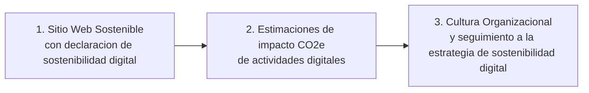

# Interdato | Sostenibilidad Digital para ESG

Portafolio ejecutivo para presentar como la sostenibilidad digital ayuda a convertir sitios web, software, nube, datos, inteligencia artificial y canales digitales en indicadores, evidencia y acciones concretas para fortalecer una estrategia ESG.

URL del portafolio:

https://interdato-sostenibilidaddigital.github.io/ESG---Sostenibilidad-Digital/

## Por que importa

La operacion digital ya forma parte del impacto ambiental, social y de gobernanza de una organizacion. Cada sitio web, plataforma, servicio cloud, flujo de datos, modelo de IA y canal digital consume energia, utiliza infraestructura y genera huella operativa.

Incluir sostenibilidad digital dentro de ESG permite pasar de una narrativa general a evidencia concreta: estimaciones de impacto CO2e, KPIs accionables, criterios de mejora, trazabilidad y una historia mas clara para directivos, clientes, colaboradores, inversionistas y equipos de sostenibilidad.

## Que despierta interes en este portafolio

- Muestra por que lo digital ya debe medirse dentro de ESG.
- Conecta sostenibilidad, tecnologia, datos, experiencia digital y reputacion corporativa.
- Presenta una ruta clara para iniciar sin esperar al siguiente ciclo anual de reporte.
- Ayuda a convertir evidencia tecnica en decisiones ejecutivas.
- Refuerza la credibilidad de la organizacion mediante datos, transparencia y mejora continua.

## Ventajas para una organizacion

| Area | Valor para el negocio |
| --- | --- |
| Ambiental | Estimar CO2e de actividades digitales, identificar ineficiencias y priorizar reducciones. |
| Social | Mejorar accesibilidad, experiencia digital e inclusion en canales criticos. |
| Gobernanza | Crear KPIs, responsables, trazabilidad y evidencia para reportes y auditorias. |
| Reputacion | Comunicar compromisos digitales verificables ante clientes, talento e inversionistas. |
| Operacion | Convertir hallazgos en backlog, decisiones de arquitectura, mejoras de nube y optimizacion de canales. |

## Flujo de adopcion



### 1. Sitio Web Sostenible con declaracion de sostenibilidad digital

El primer paso es convertir el sitio web en una prueba visible de compromiso: una experiencia ligera, accesible, eficiente y respaldada por una declaracion publica de sostenibilidad digital.

### 2. Estimaciones de impacto CO2e de actividades digitales

El segundo paso es estimar el impacto ambiental de la operacion digital, incluyendo sitios web, software, nube, datos, inteligencia artificial y canales digitales. Estas estimaciones permiten crear KPIs, detectar oportunidades de mejora y priorizar acciones.

### 3. Cultura Organizacional y Seguimiento a la Estrategia de Sostenibilidad Digital

El tercer paso es integrar la sostenibilidad digital en la cultura y operacion diaria: responsables, seguimiento, indicadores, recomendaciones accionables y mejora continua alineada con la estrategia ESG.

## Mensaje central

La sostenibilidad digital no es solo una iniciativa tecnica. Es una forma de operar mejor, reportar mejor y demostrar que la transformacion digital tambien puede ser medible, responsable y alineada con los compromisos ESG de la organizacion.

## Implementacion del portafolio

El sitio esta construido con HTML y CSS puro para mantenerlo ligero, facil de auditar y consistente con los principios de sostenibilidad digital de Interdato.

## Whitepaper

La fuente editable del whitepaper se encuentra en `whitepaper/whitepaper-ejecutivo.html`.
Para regenerar `assets/whitepaper-ejecutivo.pdf` en Windows con Microsoft Edge o Google
Chrome instalado:

```powershell
.\scripts\build-whitepaper.ps1
```
