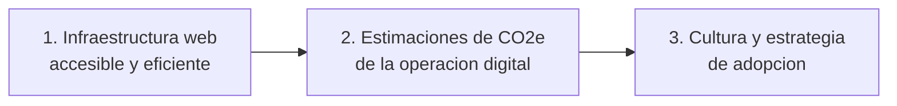

# Interdato | Sostenibilidad Digital para ESG

Portafolio ejecutivo para presentar como la sostenibilidad digital ayuda a convertir sitios web, software, nube, datos, inteligencia artificial y canales digitales en indicadores, evidencia y acciones concretas para fortalecer una estrategia ESG.

URL del portafolio:

https://interdato-sostenibilidaddigital.github.io/ESG---Sostenibilidad-Digital/

## Por que importa

La operacion digital ya forma parte del impacto ambiental, social y de gobernanza de una organizacion. Cada sitio web, plataforma, servicio cloud, flujo de datos, modelo de IA y canal digital consume energia, utiliza infraestructura y genera huella operativa.

Incluir sostenibilidad digital dentro de ESG permite pasar de una narrativa general a evidencia concreta: estimaciones de impacto CO2e, KPIs accionables, criterios de mejora, trazabilidad y una historia mas clara para directivos, clientes, colaboradores, inversionistas y equipos de sostenibilidad.

## Que despierta interes en este portafolio

- Muestra por que lo digital ya debe medirse dentro de ESG.
- Conecta sostenibilidad, tecnologia, datos, experiencia digital y reputacion corporativa.
- Presenta una ruta clara para iniciar sin esperar al siguiente ciclo anual de reporte.
- Ayuda a convertir evidencia tecnica en decisiones ejecutivas.
- Refuerza la credibilidad de la organizacion mediante datos, transparencia y mejora continua.

## Ventajas para una organizacion

| Area | Valor para el negocio |
| --- | --- |
| Ambiental | Estimar CO2e de actividades digitales, identificar ineficiencias y priorizar reducciones. |
| Social | Mejorar accesibilidad, experiencia digital e inclusion en canales criticos. |
| Gobernanza | Crear KPIs, responsables, trazabilidad y evidencia para reportes y auditorias. |
| Reputacion | Comunicar compromisos digitales verificables ante clientes, talento e inversionistas. |
| Operacion | Convertir hallazgos en backlog, decisiones de arquitectura, mejoras de nube y optimizacion de canales. |

## Flujo de adopcion



### 1. Infraestructura web

El primer paso es contar con un sitio web accesible y eficiente, estimar el CO2e por visita e incorporar el Distintivo EcoWebCO2.

### 2. Estimaciones de CO2e

El segundo paso es diagnosticar la infraestructura digital, estimar la huella de CO2e de los activos y actividades digitales e identificar areas de oportunidad.

### 3. Cultura y estrategia

El tercer paso es definir una estrategia de seguimiento y adopcion, junto con un programa de cultura organizacional para operar de manera mas eficiente.

## Mensaje central

La sostenibilidad digital no es solo una iniciativa tecnica. Es una forma de operar mejor, reportar mejor y demostrar que la transformacion digital tambien puede ser medible, responsable y alineada con los compromisos ESG de la organizacion.

## Implementacion del portafolio

El sitio esta construido con HTML y CSS puro para mantenerlo ligero, facil de auditar y consistente con los principios de sostenibilidad digital de Interdato.

## Presupuesto de rendimiento

Para evitar regresiones, cada cambio debe mantener estos limites, medidos con cache vacia y
sin incluir descargas iniciadas por el usuario:

- Carga inicial transferida: maximo 175 KB.
- Pagina completa despues de recorrerla: maximo 300 KB.
- Propuesta PDF: maximo 250 KB.
- Dependencias JavaScript de ejecucion: ninguna mientras las APIs nativas cubran la funcionalidad.

Las imagenes deben publicarse con dimensiones acordes a su uso, formatos modernos cuando
aporten una reduccion real y un respaldo compatible. Los recursos secundarios deben conservar
carga diferida.

## Propuesta descargable

La fuente editable de la propuesta se encuentra en `propuesta/propuesta-sostenibilidad-digital.html`.
Para regenerar `assets/propuesta-sostenibilidad-digital.pdf` en Windows con Microsoft Edge o Google
Chrome instalado:

```powershell
.\scripts\build-propuesta.ps1
```
